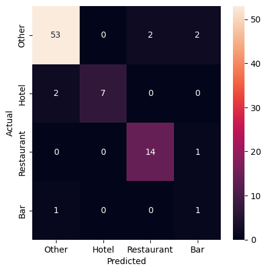
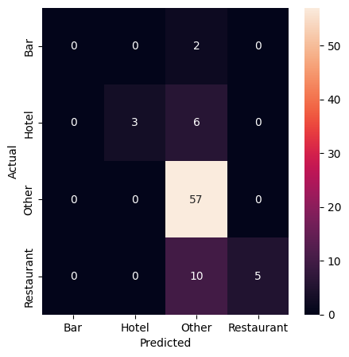

# Evaluation

Before you publish anything, you'll want to be sure you can trust the LLM's classifications. Spot checks are not enough. You need a systematic way to evaluate your model's performance.

This is where traditional machine-learning techniques still play a vital role. Let's take a step back to learn how a longstanding technique known as supervision can evaluate an LLM prompt.

## Lessons from the past

Before the advent of large-language models, machine-learning systems were created using a technique called [supervised learning](https://en.wikipedia.org/wiki/Supervised_learning). This approach required users to provide carefully prepared data that showed the computer how to behave.

For instance, if you were developing a model to distinguish between spam emails and legitimate ones, you would provide the model with a set of emails that had already been properly classified as spam or not spam.

The model would then use that data to learn the relationships between the inputs and outputs, which it could apply to new emails it hadn't seen before. This process is called training.

In systems like that, the supervised input is split into two separate sets: one for training the model and another held aside for testing its performance.

```{raw} html
<script src="https://cdnjs.cloudflare.com/ajax/libs/d3/7.9.0/d3.min.js"></script>
<div id="train-test-split" style="margin: 20px 0; width: 100%;"></div>
<script>
(function() {
  const width = 700;
  const height = 280;
  const dotRadius = 9;
  const dotSpacing = 26;

  const categories = [
    { label: "Restaurant", color: "#43a047" },
    { label: "Bar",        color: "#e65100" },
    { label: "Hotel",      color: "#1565c0" },
    { label: "Other",      color: "#7b1fa2" },
  ];

  // 50 dots with mixed colors, pre-arranged so both splits get all 4 colors
  // Training (first 33): 8 Restaurant, 3 Bar, 5 Hotel, 17 Other
  // Test (last 17): 4 Restaurant, 2 Bar, 3 Hotel, 8 Other
  const pattern = [
    3,0,2,3,1,0,3,2,0,3,
    0,3,1,3,2,0,3,0,3,2,
    3,1,0,3,3,0,2,3,3,3,
    0,2,3,
    3,0,2,1,3,0,3,2,0,1,
    3,0,3,2,3,0,3,
  ];
  const dots = pattern.map((catIdx, i) => ({
    id: i,
    cat: categories[catIdx],
  }));

  const trainDots = dots.slice(0, 33);
  const testDots = dots.slice(33);

  // Combined grid: 10 columns x 5 rows
  const cols = 10;
  const centerX = width / 2;
  const centerY = height / 2 + 8;

  function gridPos(idx) {
    const row = Math.floor(idx / cols);
    const col = idx % cols;
    const totalRows = Math.ceil(dots.length / cols);
    const gridW = (cols - 1) * dotSpacing;
    const gridH = (totalRows - 1) * dotSpacing;
    return {
      x: centerX - gridW / 2 + col * dotSpacing,
      y: centerY - gridH / 2 + row * dotSpacing,
    };
  }

  // Training cluster: 7 columns, left side
  const trainCenterX = width * 0.27;
  const trainCols = 7;
  function trainPos(idx) {
    const row = Math.floor(idx / trainCols);
    const col = idx % trainCols;
    const totalRows = Math.ceil(trainDots.length / trainCols);
    const gridW = (trainCols - 1) * dotSpacing;
    const gridH = (totalRows - 1) * dotSpacing;
    return {
      x: trainCenterX - gridW / 2 + col * dotSpacing,
      y: centerY - gridH / 2 + row * dotSpacing,
    };
  }

  // Test cluster: 5 columns, right side
  const testCenterX = width * 0.74;
  const testCols = 5;
  function testPos(idx) {
    const row = Math.floor(idx / testCols);
    const col = idx % testCols;
    const totalRows = Math.ceil(testDots.length / testCols);
    const gridW = (testCols - 1) * dotSpacing;
    const gridH = (totalRows - 1) * dotSpacing;
    return {
      x: testCenterX - gridW / 2 + col * dotSpacing,
      y: centerY - gridH / 2 + row * dotSpacing,
    };
  }

  const svg = d3.select("#train-test-split")
    .append("svg")
    .attr("viewBox", `0 0 ${width} ${height}`)
    .attr("preserveAspectRatio", "xMidYMid meet")
    .style("width", "100%")
    .style("height", "auto");

  const combinedLabel = svg.append("text")
    .attr("x", centerX)
    .attr("y", 24)
    .attr("text-anchor", "middle")
    .attr("font-size", 16)
    .attr("font-weight", 600)
    .attr("fill", "#333")
    .text("Supervised Sample");

  const trainLabel = svg.append("text")
    .attr("x", trainCenterX)
    .attr("y", 24)
    .attr("text-anchor", "middle")
    .attr("font-size", 16)
    .attr("font-weight", 600)
    .attr("fill", "#333")
    .attr("opacity", 0)
    .text("Training (67%)");

  const testLabel = svg.append("text")
    .attr("x", testCenterX)
    .attr("y", 24)
    .attr("text-anchor", "middle")
    .attr("font-size", 16)
    .attr("font-weight", 600)
    .attr("fill", "#333")
    .attr("opacity", 0)
    .text("Test (33%)");

  const divider = svg.append("line")
    .attr("x1", centerX)
    .attr("y1", 38)
    .attr("x2", centerX)
    .attr("y2", height - 8)
    .attr("stroke", "#ccc")
    .attr("stroke-width", 1.5)
    .attr("stroke-dasharray", "6,4")
    .attr("opacity", 0);

  const dotEls = svg.selectAll("circle.dot")
    .data(dots)
    .enter()
    .append("circle")
    .attr("class", "dot")
    .attr("cx", (d, i) => gridPos(i).x)
    .attr("cy", (d, i) => gridPos(i).y)
    .attr("r", dotRadius)
    .attr("fill", d => d.cat.color)
    .attr("opacity", 0.9);

  function animate() {
    setTimeout(() => {
      combinedLabel.transition().duration(400).attr("opacity", 0);
      trainLabel.transition().duration(400).delay(300).attr("opacity", 1);
      testLabel.transition().duration(400).delay(300).attr("opacity", 1);
      divider.transition().duration(400).delay(300).attr("opacity", 1);

      dotEls.transition()
        .duration(1000)
        .delay((d, i) => 200 + Math.random() * 300)
        .ease(d3.easeQuadInOut)
        .attr("cx", d => {
          const trainIdx = trainDots.indexOf(d);
          if (trainIdx >= 0) return trainPos(trainIdx).x;
          return testPos(testDots.indexOf(d)).x;
        })
        .attr("cy", d => {
          const trainIdx = trainDots.indexOf(d);
          if (trainIdx >= 0) return trainPos(trainIdx).y;
          return testPos(testDots.indexOf(d)).y;
        });

      setTimeout(() => {
        trainLabel.transition().duration(400).attr("opacity", 0);
        testLabel.transition().duration(400).attr("opacity", 0);
        divider.transition().duration(400).attr("opacity", 0);
        combinedLabel.transition().duration(400).delay(300).attr("opacity", 1);

        dotEls.transition()
          .duration(1000)
          .delay((d, i) => 200 + Math.random() * 300)
          .ease(d3.easeQuadInOut)
          .attr("cx", (d, i) => gridPos(i).x)
          .attr("cy", (d, i) => gridPos(i).y);

        setTimeout(animate, 2000);
      }, 3500);
    }, 2000);
  }

  animate();
})();
</script>
```

After the model is trained using the first set, it is evaluated using the second set. Since the testing set is withheld from the model during training, it provides a way to measure how well the model can generalize to data it hasn't seen before. If the training was successful, the model should be able to correctly classify most of the instances in the test set.

```{raw} html
<div id="test-evaluation" style="margin: 20px 0; width: 100%;"></div>
<script>
(function() {
  const width = 700;
  const height = 260;
  const dotRadius = 9;
  const dotSpacing = 28;

  const categories = [
    { label: "Restaurant", color: "#43a047" },
    { label: "Bar",        color: "#e65100" },
    { label: "Hotel",      color: "#1565c0" },
    { label: "Other",      color: "#7b1fa2" },
  ];

  // 17 test dots: 4 Restaurant, 2 Bar, 3 Hotel, 8 Other (matches first graphic)
  const truePattern =  [3,0,2,1,3,0,3,2,0,1,3,0,3,2,3,0,3];
  // Predictions: 15 correct, 2 wrong (~88% accuracy)
  // Mismatches at index 7 (Hotel->Other) and index 11 (Restaurant->Other)
  const predPattern =  [3,0,2,1,3,0,3,3,0,1,3,3,3,2,3,0,3];

  const dots = truePattern.map((catIdx, i) => ({
    id: i,
    trueCat: categories[catIdx],
    predCat: categories[predPattern[i]],
    correct: catIdx === predPattern[i],
  }));

  const cols = 5;
  const leftCenterX = width * 0.27;
  const rightCenterX = width * 0.73;
  const centerY = height / 2 + 4;

  function gridPos(idx, cx) {
    const row = Math.floor(idx / cols);
    const col = idx % cols;
    const totalRows = Math.ceil(dots.length / cols);
    const gridW = (cols - 1) * dotSpacing;
    const gridH = (totalRows - 1) * dotSpacing;
    return {
      x: cx - gridW / 2 + col * dotSpacing,
      y: centerY - gridH / 2 + row * dotSpacing,
    };
  }

  const svg = d3.select("#test-evaluation")
    .append("svg")
    .attr("viewBox", `0 0 ${width} ${height}`)
    .attr("preserveAspectRatio", "xMidYMid meet")
    .style("width", "100%")
    .style("height", "auto");

  // Labels
  svg.append("text")
    .attr("x", leftCenterX)
    .attr("y", 20)
    .attr("text-anchor", "middle")
    .attr("font-size", 16)
    .attr("font-weight", 600)
    .attr("fill", "#333")
    .text("Test Answers");

  svg.append("text")
    .attr("x", rightCenterX)
    .attr("y", 20)
    .attr("text-anchor", "middle")
    .attr("font-size", 16)
    .attr("font-weight", 600)
    .attr("fill", "#333")
    .text("Model Predictions");

  // Divider
  svg.append("line")
    .attr("x1", width / 2)
    .attr("y1", 30)
    .attr("x2", width / 2)
    .attr("y2", height - 20)
    .attr("stroke", "#ccc")
    .attr("stroke-width", 1.5)
    .attr("stroke-dasharray", "6,4");

  // Left dots: always show true colors
  const trueDots = svg.selectAll("circle.true-dot")
    .data(dots)
    .enter()
    .append("circle")
    .attr("class", "true-dot")
    .attr("cx", (d, i) => gridPos(i, leftCenterX).x)
    .attr("cy", (d, i) => gridPos(i, leftCenterX).y)
    .attr("r", dotRadius)
    .attr("fill", d => d.trueCat.color)
    .attr("opacity", 0.9);

  // Right dots: start gray, will animate
  const predDots = svg.selectAll("circle.pred-dot")
    .data(dots)
    .enter()
    .append("circle")
    .attr("class", "pred-dot")
    .attr("cx", (d, i) => gridPos(i, rightCenterX).x)
    .attr("cy", (d, i) => gridPos(i, rightCenterX).y)
    .attr("r", dotRadius)
    .attr("fill", "#ccc")
    .attr("opacity", 0.9);

  // Red rings for wrong answers (left side)
  const wrongLeftRings = svg.selectAll("circle.wrong-left")
    .data(dots.filter(d => !d.correct))
    .enter()
    .append("circle")
    .attr("class", "wrong-left")
    .attr("cx", (d) => gridPos(dots.indexOf(d), leftCenterX).x)
    .attr("cy", (d) => gridPos(dots.indexOf(d), leftCenterX).y)
    .attr("r", dotRadius + 5)
    .attr("fill", "none")
    .attr("stroke", "#d32f2f")
    .attr("stroke-width", 3)
    .attr("opacity", 0);

  // Red rings for wrong answers (right side)
  const wrongRightRings = svg.selectAll("circle.wrong-right")
    .data(dots.filter(d => !d.correct))
    .enter()
    .append("circle")
    .attr("class", "wrong-right")
    .attr("cx", (d) => gridPos(dots.indexOf(d), rightCenterX).x)
    .attr("cy", (d) => gridPos(dots.indexOf(d), rightCenterX).y)
    .attr("r", dotRadius + 5)
    .attr("fill", "none")
    .attr("stroke", "#d32f2f")
    .attr("stroke-width", 3)
    .attr("opacity", 0);

  // Red connecting lines between mismatched pairs
  const wrongLines = svg.selectAll("line.wrong-line")
    .data(dots.filter(d => !d.correct))
    .enter()
    .append("line")
    .attr("class", "wrong-line")
    .attr("x1", (d) => gridPos(dots.indexOf(d), leftCenterX).x + dotRadius + 6)
    .attr("y1", (d) => gridPos(dots.indexOf(d), leftCenterX).y)
    .attr("x2", (d) => gridPos(dots.indexOf(d), rightCenterX).x - dotRadius - 6)
    .attr("y2", (d) => gridPos(dots.indexOf(d), rightCenterX).y)
    .attr("stroke", "#d32f2f")
    .attr("stroke-width", 2)
    .attr("stroke-dasharray", "4,3")
    .attr("opacity", 0);

  // Accuracy label
  const correctCount = dots.filter(d => d.correct).length;
  const accuracy = Math.round(correctCount / dots.length * 100);
  const scoreLabel = svg.append("text")
    .attr("x", width / 2)
    .attr("y", height - 6)
    .attr("text-anchor", "middle")
    .attr("font-size", 15)
    .attr("font-weight", 600)
    .attr("fill", "#333")
    .attr("opacity", 0)
    .text(`Accuracy: ${accuracy}%`);

  function animate() {
    // Phase 1: Reveal predictions one by one
    predDots.transition()
      .duration(300)
      .delay((d, i) => i * 120)
      .attr("fill", d => d.predCat.color);

    const revealTime = dots.length * 120 + 500;

    // Phase 2: Fade correct dots back, spotlight errors
    setTimeout(() => {
      // Dim correct dots on both sides
      trueDots.filter(d => d.correct).transition().duration(500).attr("opacity", 0.25);
      predDots.filter(d => d.correct).transition().duration(500).attr("opacity", 0.25);

      // Pop wrong dots: scale up slightly
      trueDots.filter(d => !d.correct).transition().duration(400).attr("r", dotRadius + 2);
      predDots.filter(d => !d.correct).transition().duration(400).attr("r", dotRadius + 2);

      // Show red rings and connecting lines
      wrongLeftRings.transition().duration(400).attr("opacity", 1);
      wrongRightRings.transition().duration(400).attr("opacity", 1);
      wrongLines.transition().duration(400).delay(200).attr("opacity", 0.7);

      // Show score
      scoreLabel.transition().duration(400).delay(600).attr("opacity", 1);
    }, revealTime);

    // Phase 3: Hold, then reset
    setTimeout(() => {
      // Fade out error highlights
      wrongLeftRings.transition().duration(400).attr("opacity", 0);
      wrongRightRings.transition().duration(400).attr("opacity", 0);
      wrongLines.transition().duration(400).attr("opacity", 0);
      scoreLabel.transition().duration(400).attr("opacity", 0);

      // Restore all dots to normal
      trueDots.transition().duration(400).delay(400).attr("opacity", 0.9).attr("r", dotRadius);
      predDots.transition().duration(400).delay(400).attr("opacity", 0.9).attr("r", dotRadius);

      // Reset predictions to gray
      predDots.transition().duration(400).delay(800).attr("fill", "#ccc");

      // Restart
      setTimeout(animate, 1800);
    }, revealTime + 4000);
  }

  // Initial delay before first run
  setTimeout(animate, 1500);
})();
</script>
```

Large-language models operate differently. They are trained on vast amounts of text and can generate responses based on various machine-learning approaches. The result is that you can use them without providing supervised data beforehand.

This is a significant advantage. However, it raises questions about how to evaluate the accuracy of an LLM prompt. Without a supervised sample to test its results, we can't be sure if the model is performing well or just getting lucky with its guesses. Furthermore, without knowing where it gets things wrong, we don't know what adjustments could improve its performance.

## Creating a supervised sample

That's why, even though LLMs don't require supervised data to function, it's still a good idea to create a supervised sample for evaluation purposes.

Start by outputting a random sample from the dataset you're studying to a file of comma-separated values. In general, the larger the sample the better the evaluation, though at a certain point the returns diminish. For this exercise, let's use pandas to create a sample of 250 records and export it to a file called `sample.csv`.

```python
df.sample(250).to_csv("./sample.csv", index=False)
```

You would then open the file in a spreadsheet program like Excel or Google Sheets. For each payee in the sample, you would provide the correct category in a new companion column. As you fill it in with the correct answers, this gradually becomes your supervised sample. That's all there is to it.


To speed the class along, we've already prepared a sample for you in [the class repository](https://github.com/palewire/first-llm-classifier). Create a new cell and read it into a DataFrame.

```python
sample_df = pd.read_csv(
    "https://raw.githubusercontent.com/palewire/first-llm-classifier/refs/heads/main/_notebooks/sample.csv"
)
```

Install the Python packages [`scikit-learn`](https://scikit-learn.org/stable/) and [`matplotlib`](https://matplotlib.org/). Prior to LLMs, these libraries were the go-to tools for training and evaluating machine-learning models. We'll primarily be using them for testing.

```
!uv add scikit-learn matplotlib
```

Add the [`train_test_split`](https://scikit-learn.org/stable/modules/generated/sklearn.model_selection.train_test_split.html) function from `scikit-learn` to the import statement. This tool is used to split a supervised sample into separate sets for training and testing.

{emphasize-lines="9"}

```python
from pydantic import BaseModel
import time
from typing import Literal
from itertools import batched
from rich import print
from rich.progress import track
from huggingface_hub import InferenceClient
import pandas as pd
from sklearn.model_selection import train_test_split
```

The first input is the DataFrame column containing the payee names. The second input is the DataFrame column containing the correct categories.

The `test_size` parameter determines the proportion of the sample that will be used for testing. In traditional machine-learning setups, a common split is 67% for training and 33% for testing. In our circumstance, where we're not actually training a model, we will reverse the proportions and use 67% of the sample for testing to get a more robust evaluation of our LLM's performance.

The `random_state` parameter ensures that the split is reproducible by setting a seed for the random number generator that draws the samples. This will ensure that you get the same training and testing sets each time you run the code, which is important for consistent evaluation.

```python
training_input, test_input, training_output, test_output = train_test_split(
    sample_df[["payee"]],
    sample_df["category"],
    test_size=0.67,
    random_state=42,  # Remember Jackie Robinson. Remember Douglas Adams.
)
```

## Evaluating performance

In a traditional training setup, the next step would be to train a machine-learning model in `sklearn` using the `training_input` and `training_output` sets. The model would then be evaluated using the `test_input` and `test_output` sets.

With an LLM we skip ahead to the testing phase. We pass the `test_input` set to our LLM prompt and compare its guesses to the right answers found in `test_output` set.

All that requires is that we pass the `payee` column from our `test_input` DataFrame to the function we created in the previous chapters.

```python
llm_df = classify_batches(test_input.payee)
```

Next, we import the `classification_report` function from `sklearn`, which is used to evaluate a model's performance.

{emphasize-lines="9"}

```python
import json
import time
from rich import print
from rich.progress import track
from huggingface_hub import InferenceClient
import pandas as pd
from itertools import batched
from sklearn.model_selection import train_test_split
from sklearn.metrics import classification_report
```

The [`classification_report`](https://scikit-learn.org/stable/modules/generated/sklearn.metrics.classification_report.html) function generates a report card on a model's performance. You provide it with the correct answers in the `test_output` set and the model's predictions in your prompt's DataFrame. In this case, our LLM's predictions are stored in the `llm_df` DataFrame's `category` column.

```python
print(classification_report(test_output, llm_df.category))
```

That will output a report that looks something like this:

```
             precision    recall  f1-score   support

         Bar       0.25      1.00      0.40         2
       Hotel       0.90      1.00      0.95        18
       Other       0.99      0.93      0.96       112
  Restaurant       0.91      0.89      0.90        36

    accuracy                           0.93       168
   macro avg       0.76      0.95      0.80       168
weighted avg       0.96      0.93      0.94       168
```

At first, the report can be a bit overwhelming. What are all these technical terms? How do I read this damn thing? Let's walk through it.

The precision column measures what statistics nerds call ["positive predictive value."](https://en.wikipedia.org/wiki/Positive_and_negative_predictive_values) It's how often the model made the correct decision when it applied a category. For instance, in the "Bar" category here, the LLM has a precision of 0.25, which means only one out of four "Bar" predictions was correct. An analogy here is a baseball player's contact rate. Precision is a measure of how often the model connects with the ball when it swings its bat. Our model swung at the "Bar" category four times and only made contact once.

The recall column measures how many of the supervised instances were identified by the model. In this case, it shows that the LLM correctly spotted about 89% of the restaurants in our manual sample. The total number of hotels in the sample is shown in the support column. So, out of 36 hotels, the model correctly identified 32 of them.

The f1-score is a combination of precision and recall. It's a way to measure a model's overall performance by balancing the two.

The averages at the bottom combine the results for all categories. The accuracy row shows how often the model got the right answer across all categories as a grand total. The macro row is a simple average of the precision, recall and f1-score for each category, which treats all categories equally regardless of how many instances they have in the sample. The weighted row is a weighted average based on the number of instances in each category.

In the example result above, the overall accuracy is about 93%, but the lower macro average of 0.80 shows the model is less consistent on rarer categories.

## Visualizing the results

Another technique for evaluating classifiers is to visualize the results using a chart known as a confusion matrix. This chart shows how often the model correctly predicted each category and where it got things wrong.

The `ConfusionMatrixDisplay` tool from `sklearn` can draw one for us. We just need to add it and `matplotlib` to our imports.

{emphasize-lines="9,10"}

```python
import json
import time
from rich import print
from rich.progress import track
from huggingface_hub import InferenceClient
import pandas as pd
from itertools import batched
from sklearn.model_selection import train_test_split
import matplotlib.pyplot as plt
from sklearn.metrics import ConfusionMatrixDisplay, classification_report
```

Then pass in the correct answers and the model's predictions.

```python
ConfusionMatrixDisplay.from_predictions(test_output, llm_df.category)
```



The diagonal line of cells running from the upper left to the lower right shows where the model correctly predicted the category. The off-diagonal cells show where it got things wrong. The color of the cells indicates how often the model made that prediction. For instance, we can see that one miscategorized hotel in the sample was predicted to be a restaurant and the second was predicted to be "Other."

Due to the inherent randomness in the LLM's predictions, it's a good idea to test your sample and run these reports multiple times to get a sense of the model's performance.

## The way we were

Before we look at how you might improve the LLM's performance, let's take a moment to compare the results of this evaluation against the old school approach where the supervised sample is used to train a machine-learning model that doesn't have access to the ocean of knowledge poured into an LLM.

This will require importing a mess of `sklearn` functions and classes. We'll use `TfidfVectorizer` to convert the payee text into a numerical representation that can be used by a `LinearSVC` classifier. We'll then use a `Pipeline` to chain the two together. If you have no idea what any of that means, don't worry. Now that we have LLMs in this world, you might never need to know.

{emphasize-lines="11-14"}

```python
import json
import time
from rich import print
from rich.progress import track
from huggingface_hub import InferenceClient
import pandas as pd
from itertools import batched
from sklearn.model_selection import train_test_split
import matplotlib.pyplot as plt
from sklearn.metrics import ConfusionMatrixDisplay, classification_report
from sklearn.svm import LinearSVC
from sklearn.pipeline import Pipeline
from sklearn.compose import ColumnTransformer
from sklearn.feature_extraction.text import TfidfVectorizer
```

Here's a simple example of how you might train and evaluate a traditional machine-learning model using the supervised sample.

First you setup all the machinery.

```python
vectorizer = TfidfVectorizer(
    sublinear_tf=True,
    min_df=5,
    norm="l2",
    encoding="latin-1",
    ngram_range=(1, 3),
)
preprocessor = ColumnTransformer(
    transformers=[("payee", vectorizer, "payee")], sparse_threshold=0, remainder="drop"
)
pipeline = Pipeline(
    [("preprocessor", preprocessor), ("classifier", LinearSVC(dual="auto"))]
)
```

Then you train the model using those training sets we split out at the start.

```python
model = pipeline.fit(training_input, training_output)
```

And you ask the model to use its training to predict the right answers for the test set.

```python
predictions = model.predict(test_input)
```

Now, you can run the same evaluation code as before to see how the traditional model performed.

```python
print(classification_report(test_output, predictions))
```

```
              precision    recall  f1-score   support

         Bar       0.00      0.00      0.00         2
       Hotel       1.00      0.33      0.50         9
       Other       0.76      1.00      0.86        57
  Restaurant       1.00      0.33      0.50        15

    accuracy                           0.78        83
   macro avg       0.69      0.42      0.47        83
weighted avg       0.81      0.78      0.74        83
```

```python
ConfusionMatrixDisplay.from_predictions(test_output, predictions)
```



Not great. The traditional model is guessing correctly about 75% of the time, but it's missing most cases of our "Bar", "Hotel" and "Restaurant" categories as almost everything is getting filed as "Other." The LLM, on the other hand, is guessing correctly more than 90% of the time and flagging many of the rare categories that we're seeking to find in the haystack of data.

## Comparing models

Our evaluation so far has only tested one LLM. But Hugging Face offers [dozens of models](https://huggingface.co/models) and we can't be sure that the one we picked is the best for our task. Let's adapt our code so we can easily compare how different models perform.

The first step is to add a `model` parameter to our `classify_payees` function and pass it through to the API call. This replaces the hardcoded model name with a variable.

{emphasize-lines="1,36"}

```python
def classify_payees(name_list, model):
    prompt = """
You are an AI model trained to categorize businesses based on their names.

You will be given a list of business names, each separated by a new line.

Your task is to analyze each name and classify it into one of the following categories: Restaurant, Bar, Hotel, or Other.

If a business does not clearly fall into Restaurant, Bar, or Hotel categories, you should classify it as "Other".

Even if the type of business is not immediately clear from the name, it is essential that you provide your best guess based on the information available to you. If you can't make a good guess, classify it as Other.

For example, if given the following input:

"Intercontinental Hotel\nPizza Hut\nCheers\nWelsh's Family Restaurant\nKTLA\nDirect Mailing"

Your output should be a JSON object in the following format:

{"answers": ["Hotel", "Restaurant", "Bar", "Restaurant", "Other", "Other"]}

This means that you have classified "Intercontinental Hotel" as a Hotel, "Pizza Hut" as a Restaurant, "Cheers" as a Bar, "Welsh's Family Restaurant" as a Restaurant, and both "KTLA" and "Direct Mailing" as Other.
"""

    response = client.chat.completions.create(
        messages=[
            {
                "role": "system",
                "content": prompt,
            },
            {
                "role": "user",
                "content": "Intercontinental Hotel\nPizza Hut\nCheers\nWelsh's Family Restaurant\nKTLA\nDirect Mailing",
            },
            {
                "role": "assistant",
                "content": '{"answers": ["Hotel", "Restaurant", "Bar", "Restaurant", "Other", "Other"]}',
            },
            {
                "role": "user",
                "content": "Subway Sandwiches\nRuth Chris Steakhouse\nPolitical Consulting Co\nThe Lamb's Club",
            },
            {
                "role": "assistant",
                "content": '{"answers": ["Restaurant", "Restaurant", "Other", "Bar"]}',
            },
            {
                "role": "user",
                "content": "\n".join(name_list),
            },
        ],
        model=model,
        response_format={
            "type": "json_schema",
            "json_schema": {
                "name": "PayeeList",
                "schema": PayeeList.model_json_schema()
            }
        },
        temperature=0,
    )

    result = PayeeList.model_validate_json(response.choices[0].message.content)
    return dict(zip(name_list, result.answers))
```

We need the same change in `classify_batches`, accepting the model and passing it through.

{emphasize-lines="1,7"}

```python
def classify_batches(name_list, model, batch_size=20, wait=1):
    """Split a list of names into batches and classify them one by one."""
    all_results = {}

    for batch in track(batched(name_list, batch_size)):
        # Classify it with the LLM
        batch_results = classify_payees(list(batch), model)

        all_results.update(batch_results)

        time.sleep(wait)

    return pd.DataFrame(all_results.items(), columns=["payee", "category"])
```

Now we can test our prompt against a list of models. Let's try three.

```python
model_list = [
    "meta-llama/Llama-4-Maverick-17B-128E-Instruct-FP8",
    "google/gemma-3-27b-it",
    "Qwen/Qwen2.5-72B-Instruct",
]
```

Loop through each model, classify the test set and print a `classification_report` for each.

```python
for m in model_list:
    print(f"Model: {m}")
    result_df = classify_batches(test_input.payee, m)
    print(classification_report(test_output, result_df.category))
```

Now you can see at a glance which model does the best job on your task and make an informed choice about which one to use going forward.
