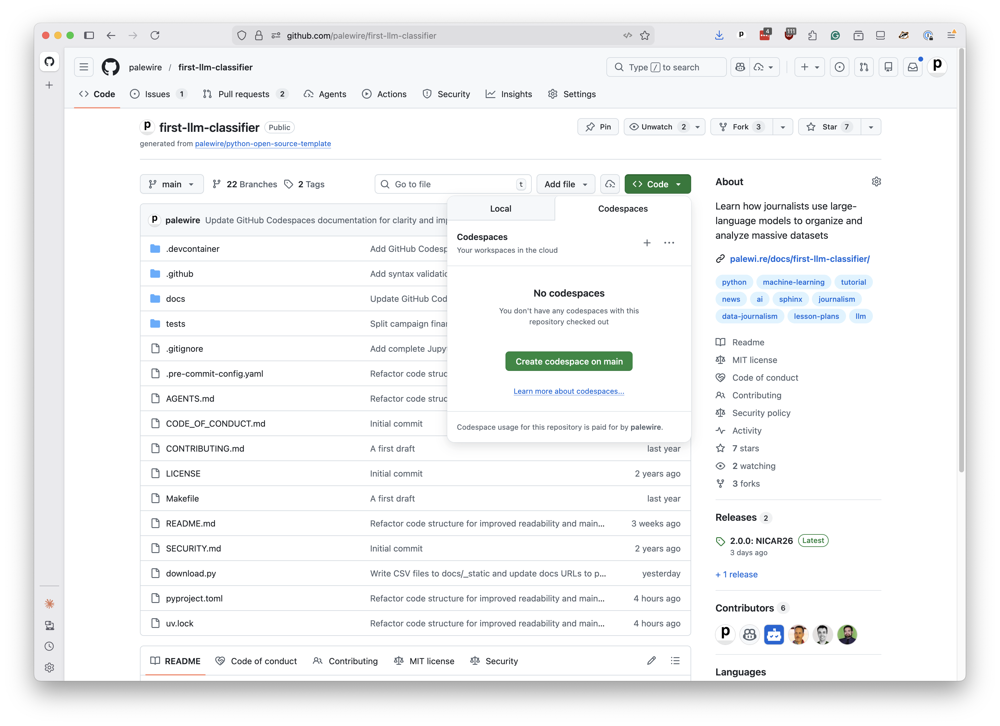
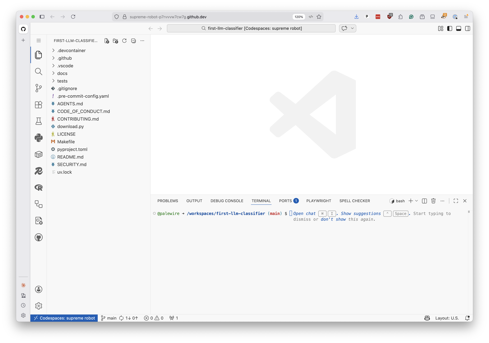
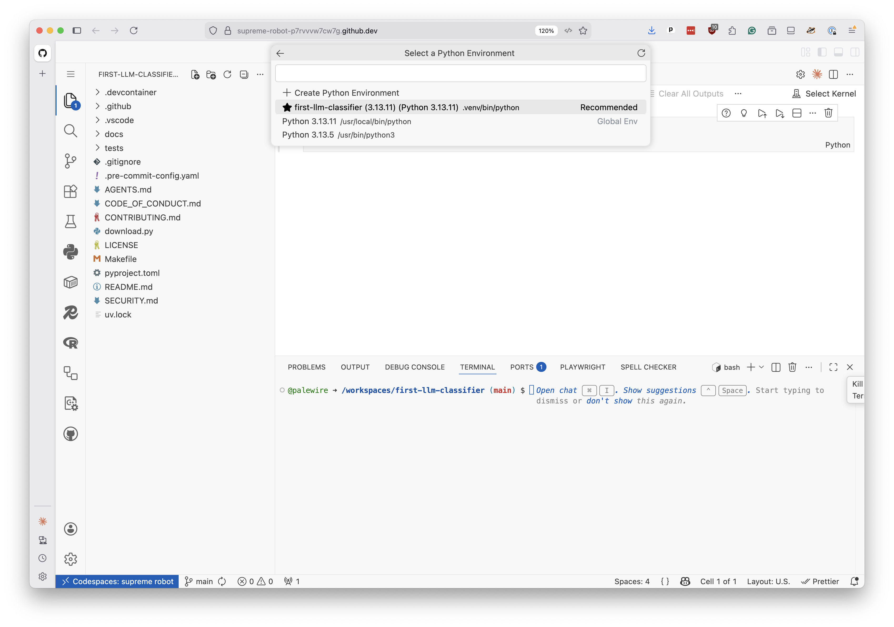
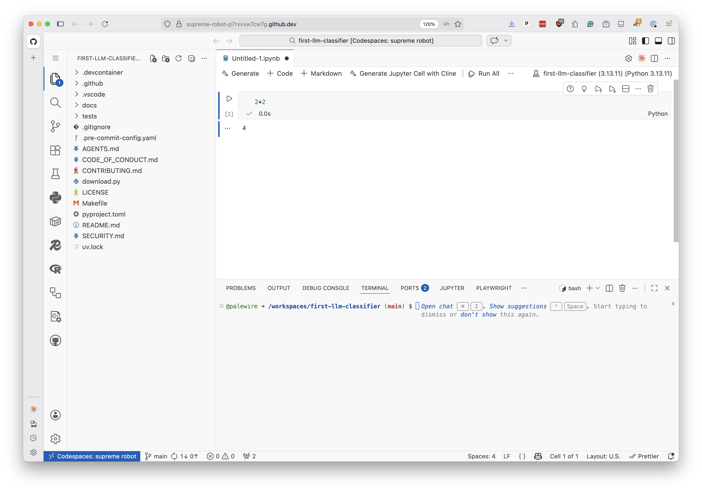

# GitHub Codespaces

If you want to get started quickly without installing anything on your computer, you can use [GitHub Codespaces](https://github.com/features/codespaces) to work through this class entirely in your browser.

Codespaces provides a complete, pre-configured coding environment in the cloud. It runs Visual Studio Code with Python, Jupyter notebooks and all the libraries you need.

```{note}
GitHub offers a [free tier](https://docs.github.com/en/billing/managing-billing-for-your-products/managing-billing-for-github-codespaces/about-billing-for-github-codespaces#monthly-included-storage-and-core-hours-for-personal-accounts) that includes a limited number hours of usage per month. If you're a university student, you may be able to get greater access through the [GitHub Student Developer Pack](https://education.github.com/pack).

Either way, the free tier should be more than enough for this class. All you need is a free [GitHub account](https://github.com/signup) to use it.
```

## Open a codespace

Visit this class's repository at [github.com/palewire/first-llm-classifier](https://github.com/palewire/first-llm-classifier). Click the green "Code" button and select the "Codespaces" tab. Then click "Create codespace on main."



It will take a minute or two to build your environment. When it's ready, you'll see a full Visual Studio Code editor in your browser with everything pre-installed.



## Open your first notebook

Click "File" in the menu bar and select "New File..." from the dropdown. When prompted to choose a file type, select "Jupyter Notebook."

You will see a prompt in the upper right corner asking you to select a Python kernel. Click "Select Kernel." A popup will appear. Select "Python Environments..." and then choose the option that includes `.venv` — this is the virtual environment that was automatically created for you.



Welcome to your first notebook. Let's make sure everything is working.

Click on the first cell, type the following and hit the play button to the left of the cell, or press Shift+Enter:

```python
2+2
```

You should see the number `4` appear below the cell.



If so, congratulations. You're all set up and ready to move on to writing code.
