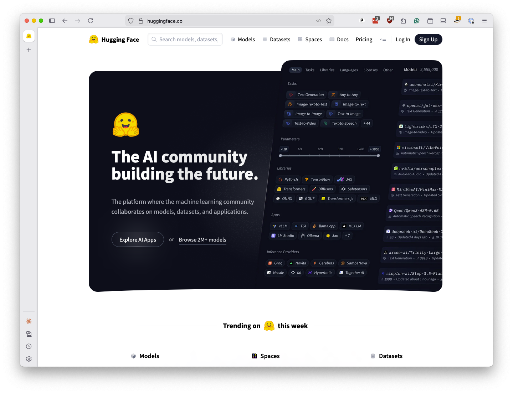
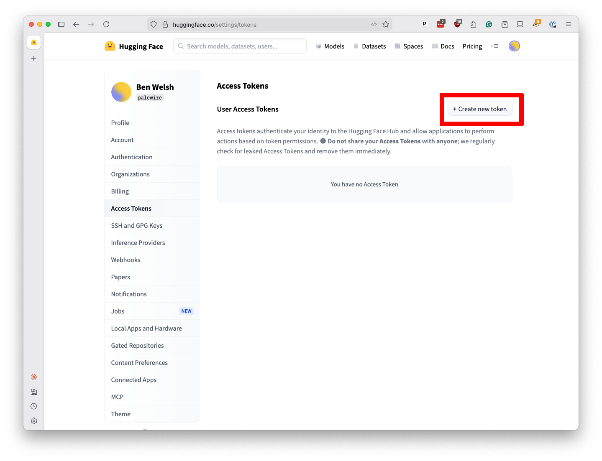

# Hugging Face

In addition to the commercial chatbots that draw the most media attention, there are many other ways to access large-language models, including free variations that you can download and run directly on your computer.

For this demonstration, we will use an online service called [Hugging Face](https://huggingface.co/). In addition to hosting thousands of models, Hugging Face offers an API that lets you send prompts to many of them at inexpensive rates. It has a generous free tier that should be sufficient for this tutorial. Its code is similar to other services, so the skills you learn here should be transferable to other platforms.

To get access to its services, go to [huggingface.co](https://huggingface.co/). Click on "Sign up" to create an account, or "Log in" if you already have one.

[](https://huggingface.co/)

When you're logged in, click the icon in the upper right and select "Access Tokens" from the dropdown menu.


Click on "Create new token" on the next page.



Create a new "fine-grained" token named `first-llm-classifier`. Be sure to check the "Make calls to Inference Providers" checkbox. Scroll to the bottom and hit the "Create token" button.


```{note}
Inference is a technical term that some people use to refer to the process of sending prompts to a large-language model and getting responses back.
```

A popup will appear with your key. I've redacted my key in this screenshot, but you should see a long string of characters. Copy it to your clipboard.


It's important to keep this key secret. If someone else gets it, they can use your account to run up charges. For now, paste that value into a text file on your computer. We'll need it later.

You can hit the "Done" button to close the popup and close the browser tab. You're ready to start writing code.
