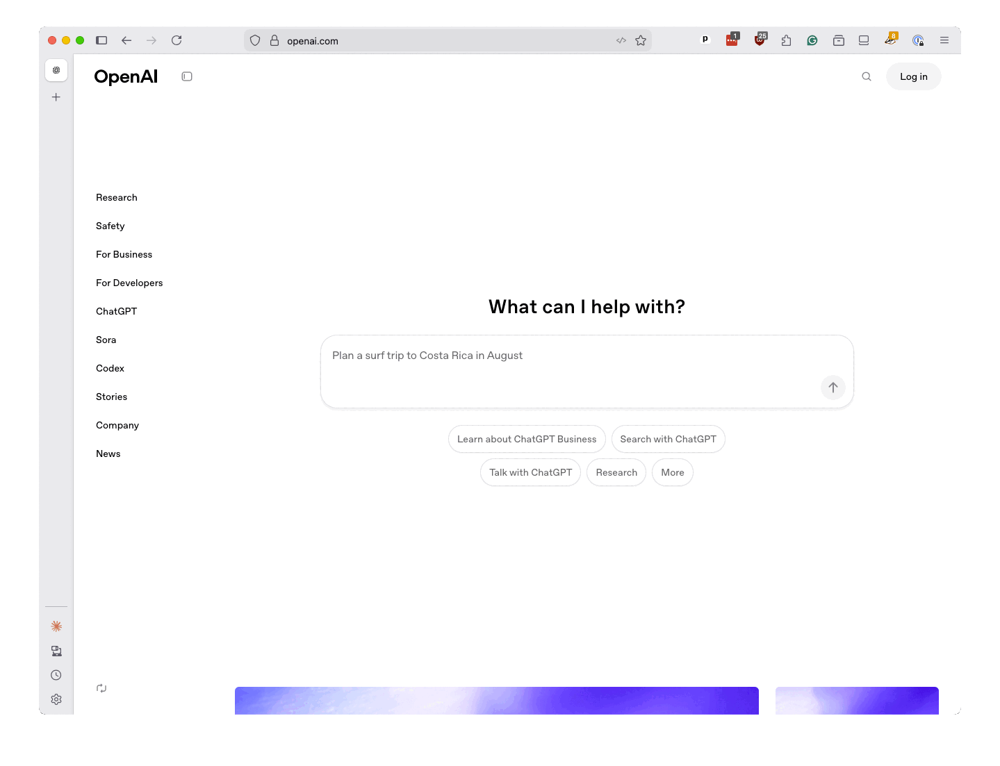

# The LLM advantage

A [large-language model](https://en.wikipedia.org/wiki/Large_language_model) is an artificial intelligence system capable of understanding and generating human language due to its extensive training on vast amounts of text. These systems are commonly referred to by the acronym LLM. The most prominent examples include OpenAI’s GPT, Google’s Gemini and Anthropic’s Claude, but there are many others, including numerous open-source options.

While they are most famous for their ability to converse with humans as chatbots, LLMs can perform a wide range of language processing tasks, including text classification, summarization and translation.

Unlike traditional machine-learning models, LLMs do not require users to provide pre-prepared training data to perform a specific task. Instead, LLMs can be prompted with a broad description of their goals and a few examples of rules they should follow. The LLMs will then generate responses informed by the massive amount of information they contain. That deep knowledge can be especially beneficial when dealing with large datasets that are difficult for humans to process on their own.

LLMs also do not require the user to understand machine-learning concepts, like vectorization or Bayesian statistics, or to write complex code to train and evaluate the model. Instead, users can submit prompts in plain language, which the model will use to generate responses. This makes it easier for journalists to experiment with different approaches and quickly iterate on their work.
